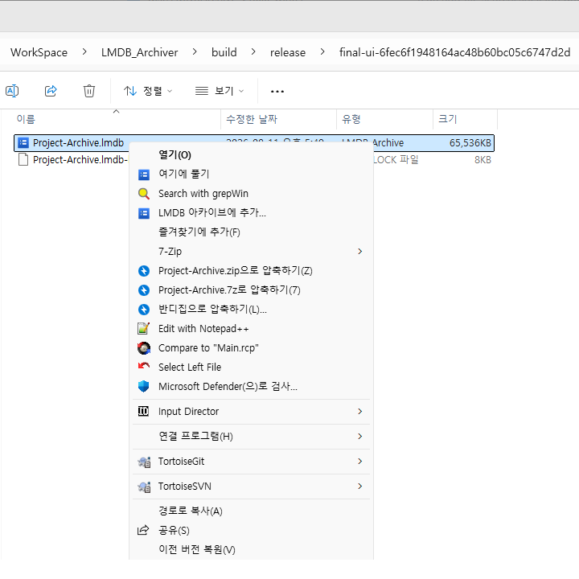

# LMDB Archiver 사용자 안내서

LMDB Archiver는 파일과 폴더 트리를 하나의 `.lmdb` 파일에 보관하면서 일반 파일 관리자처럼 내용을 열람하고 수정할 수 있는 Windows용 아카이브 관리자입니다.

화면 위쪽에는 자주 쓰는 **새로 만들기**, **열기**, **파일 추가**, **폴더 추가**, **풀기**, **삭제**가 있고, 가운데 트리에는 아카이브 내부 폴더 구조와 원본/저장 크기가 표시됩니다. 검색창은 전체 내부 경로를 즉시 필터링합니다.

## 1. 설치와 빠른 시작

1. [GitHub Releases](https://github.com/embistel/LMDBArchiver/releases/latest)에서 `LMDBArchiver-<version>-x64.msi`를 내려받아 설치합니다.
2. 보관할 폴더를 우클릭한 뒤 **LMDB 아카이브로 묶기**를 선택합니다.
3. 만들어진 `.lmdb` 파일을 더블 클릭해 내용을 확인합니다.
4. 아카이브에 파일을 더 넣으려면 앱으로 끌어 놓거나 **파일 추가**를 누릅니다.

MSI는 Qt 런타임과 필요한 플러그인을 함께 설치하므로 별도의 Qt 설치가 필요하지 않습니다. 게시된 MSI는 현재 코드 서명되지 않았으므로 Windows가 확인 창을 표시할 수 있습니다.

## 2. 아카이브 만들기

**파일 → 새 아카이브**에서 이름을 지정한 뒤 파일 또는 폴더를 추가합니다. 폴더를 추가하면 숨김 항목과 빈 폴더를 포함한 전체 트리가 저장됩니다. 동일한 내부 경로를 다시 추가하면 해당 항목이 교체됩니다.

### 앱에서 새로 만들기

**파일 → 새 아카이브**를 선택하고 `.lmdb` 이름을 지정합니다. 빈 아카이브가 열린 뒤 도구 모음에서 파일이나 폴더를 추가할 수 있습니다.

### Explorer에서 바로 만들기

폴더 자체를 우클릭하면 해당 폴더 옆에 `<폴더 이름>.lmdb`가 생성됩니다. 폴더 안의 빈 공간을 우클릭한 경우에는 **현재 폴더를 LMDB 아카이브로 묶기**를 사용할 수 있습니다.

## 3. 찾아보기와 검색

목록은 이름, 원본 크기, 저장 크기, 수정 시각, 형식을 표시합니다. 열 머리글을 눌러 정렬하고 상단 검색창에서 전체 내부 경로를 필터링할 수 있습니다.

## 4. 파일 추가, 복사와 끌어다 놓기

- Explorer의 파일이나 폴더를 트리의 원하는 폴더 위로 끌어 놓으면 그 위치에 저장됩니다.
- Explorer에서 파일을 복사한 다음 앱에서 `Ctrl+V`를 누르면 아카이브 루트에 추가됩니다.
- 아카이브 항목을 Explorer로 끌어 내리거나 `Ctrl+C` 후 Explorer에서 붙여넣을 수도 있습니다.
- 동일한 내부 경로에 다시 추가하면 최신 파일로 교체됩니다.

아카이브에서 외부로 복사할 때는 항목을 사용자 임시 폴더에 안전하게 푼 다음 표준 Windows 파일 복사로 전달합니다. 7일 이상 지난 임시 내보내기 폴더는 다음 실행 때 자동 정리됩니다.

## 5. 풀기와 삭제

- 여러 항목 선택 후 **선택 항목 풀기**: 선택 폴더는 하위 항목도 함께 풉니다.
- **모두 풀기**: 아카이브의 전체 트리를 선택한 디렉터리에 복원합니다.
- `Delete`: 선택 항목과 그 하위 항목을 트랜잭션으로 삭제합니다.

추출기는 아카이브 경로가 대상 디렉터리 밖으로 벗어나지 못하도록 검사합니다. 기존 파일은 안전한 임시 파일을 거쳐 교체됩니다.

## 6. Windows Explorer 통합

MSI 설치 패키지는 모든 사용자용 파일 연결과 우클릭 메뉴를 자동으로 등록하며 제거할 때 함께 정리합니다. Windows 11에서는 다음 메뉴가 **추가 옵션 표시** 안에 나타날 수 있습니다.

- `.lmdb` 더블 클릭: LMDB Archiver로 열기
- `.lmdb` 우클릭 → **여기에 풀기**
- 폴더 우클릭 → **LMDB 아카이브로 묶기**
- 파일 우클릭 → **LMDB 아카이브에 추가...**

휴대용 ZIP에서는 **도구 → Windows 탐색기 통합**을 사용해 현재 사용자 레지스트리에 같은 항목을 등록할 수 있습니다. 이 방식에는 관리자 권한이 필요 없으며 같은 메뉴에서 다시 실행하면 통합을 제거합니다. 프로그램 실행 파일을 옮긴 경우 통합을 제거한 후 다시 설치하십시오. MSI로 설치한 통합은 앱 메뉴가 아니라 Windows의 **설치된 앱**에서 LMDB Archiver를 제거해 해제합니다.

설치 전에 다른 프로그램이 `.lmdb`에 연결되어 있었다면 그 연결을 백업하고 통합 제거 시 복원합니다. 설치 후 사용자가 다른 기본 앱을 선택한 경우에는 제거 과정이 새 연결을 덮어쓰지 않습니다.

## 7. 검사와 용량 정리

**아카이브 → 아카이브 검사**는 모든 파일 청크를 읽고 원본 크기와 SHA-256을 대조합니다. 장기 보관 파일을 복사한 뒤나 디스크 오류가 의심될 때 실행하십시오.

항목을 많이 삭제해도 LMDB는 빈 페이지를 향후 추가 작업에 재사용하므로 `.lmdb` 파일 크기가 바로 줄지 않습니다. **아카이브 → 아카이브 압축 정리**는 compact 스냅샷을 만든 뒤 원본을 원자적으로 교체해 사용하지 않는 페이지를 실제로 회수합니다.

## 8. 데이터와 복구 주의사항

아카이브를 여는 동안 LMDB가 `<이름>.lmdb-lock` 파일을 만들 수 있습니다. 프로그램을 모두 닫은 후 이 잠금 파일은 데이터 백업에 필요하지 않습니다. `.lmdb` 데이터 파일을 네트워크 공유에서 동시에 쓰거나 프로그램 실행 중 복사하지 마십시오. 중요한 데이터는 별도 백업을 유지하십시오.
