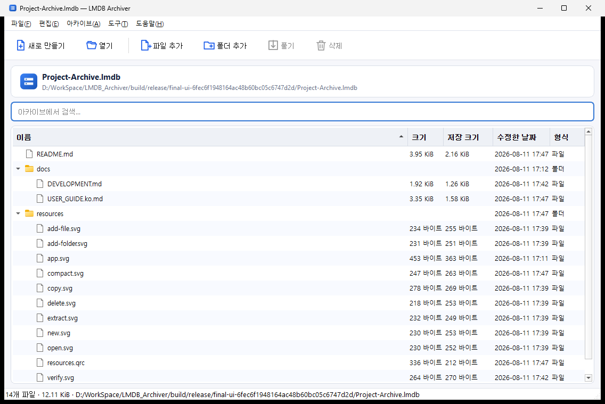

# LMDB Archiver (MOC)

> [!info] 한 줄 요약
> Windows 탐색기와 자연스럽게 연결되는 **C++17 / Qt 6 기반 데스크톱 아카이브 관리자**. [LMDB](https://github.com/LMDB/lmdb)의 ACID 트랜잭션과 메모리 맵 I/O를 저장 계층으로 사용하고, **파일을 원본 바이트 그대로** 보관한다 — 압축·헤더 없이 LucioraEla 원 시스템 및 모든 표준 LMDB 도구와 바이트 수준 호환.



---

## 📑 문서 지도 (Map of Content)

| 주제 | 노트 | 설명 |
|---|---|---|
| 🏗️ 아키텍처 | [[01·아키텍처 개요]] | 계층 구조 · 모듈 의존성 · 데이터 흐름 |
| 🗄️ 저장 포맷 | [[02·아카이브 포맷 v2]] | LMDB 키/값 레이아웃 · 청크 · SHA-256 |
| 🧠 코어 API | [[03·Archive 코어 API]] | `Archive` 클래스의 공개 인터페이스와 동작 |
| 🖥️ GUI | [[04·Qt Widgets GUI]] | MainWindow · 모델 · 드래그앤드롭 |
| ⌨️ CLI | [[05·CLI 자동화]] | `LMDBArchiverCLI` 명령과 옵션 |
| 🪟 셸 통합 | [[06·Windows 셸 통합]] | 레지스트리 · HKLM/HKCU · MSI vs 휴대용 |
| 🔨 빌드/CI | [[07·빌드와 CI]] | CMake · presets · GitHub Actions |
| 📦 패키징 | [[08·패키징과 배포]] | MSI · ZIP · WiX · windeployqt |
| 🧪 테스트 | [[09·테스트]] | Qt Test · 8개 시나리오 |
| 🔐 라이선스 | [[10·라이선스와 제3자 고지]] | MIT · OpenLDAP · LGPL |

---

## ⚙️ 핵심 메타데이터

| 항목 | 값 |
|---|---|
| 저장소 | `embistel/LMDBArchiver` |
| 버전 | `0.1.0` |
| 언어 / 표준 | C++17 (MSVC `/W4 /permissive- /utf-8`) |
| GUI 프레임워크 | Qt 6.2+ (CI는 6.8, 로컬은 6.11 검증) |
| 저장 엔진 | [LMDB 0.9.33](https://github.com/LMDB/lmdb) (정적 링크) |
| 빌드 시스템 | CMake 3.21+ (FetchContent로 LMDB 가져옴) |
| 주요 타깃 | Windows x64 (코어/UI는 Linux·macOS 빌드 가능) |
| 라이선스 | MIT (LMDB: OpenLDAP, Qt: LGPL v3) |

---

## ✨ 주요 기능

- 파일·폴더 전체를 단일 `.lmdb` 아카이브로 추가
- 트리 탐색 · 검색 · 덮어쓰기 · 삭제 · 선택/전체 추출
- Windows Explorer **양방향 끌어다 놓기**, 클립보드 복사/붙여넣기
- `.lmdb` 더블클릭 열기 · **여기에 풀기** · 폴더 **LMDB 아카이브로 묶기**
- UTF-8 경로 보존, **경로 순회 공격 방지**
- LMDB 트랜잭션 기반 **원자적 갱신** (오류/취소 시 커밋 전 상태 유지)
- 모든 레코드 **가독성 검증** (GUI/CLI)
- 빈 페이지 회수를 위한 **원자적 compact**
- **LucioraEla 원 시스템 및 모든 표준 LMDB 도구와 바이트 수준 호환**

---

## 🏛️ 왜 LMDB인가?

> [!note] 핵심 설계 결정
> LMDB 자체는 **압축 포맷이 아니다**. 키-값 DB일 뿐이다.
> 이 프로젝트는 LMDB를 있는 그대로 사용한다 — **키는 UTF-8 경로, 값은 원본 파일 바이트**. 어떤 헤더·매직·압축도 붙이지 않아 Python `lmdb`, C liblmdb, C# 등 모든 표준 도구가 아카이브를 직접 읽고 쓸 수 있다.

LMDB를 선택한 이유:
- **메모리 매핑 + zero-copy 읽기** — 별도 캐시 없이 OS 버퍼 캐시 활용
- **완전한 ACID + MVCC** — 갱신 중 오류/취소에도 안전
- **읽기 중심 동시성** — 여러 읽기 트랜잭션이 쓰기·서로를 막지 않음
- **정렬된 B+tree** — 순차 탐색·접두 경로 검색에 최적
- **작고 단순한 C 라이브러리** — 서버·로그 복구·백그라운드 정리 불필요

---

## 🚀 빠른 시작

**MSI 설치 (권장):**
[GitHub Releases](https://github.com/embistel/LMDBArchiver/releases/latest)에서 `LMDBArchiver-<version>-x64.msi` 다운로드. 자동으로 `.lmdb` 연결 + 탐색기 메뉴 등록.

**소스 빌드:**
```powershell
$env:QT_ROOT = 'F:\Qt\6.11.0\msvc2022_64'
cmake --preset qt-msvc-release
cmake --build --preset release
ctest --preset release
```

**CLI 예시:**
```powershell
LMDBArchiverCLI create photos.lmdb C:\Photos
LMDBArchiverCLI add photos.lmdb C:\More --destination imports
LMDBArchiverCLI list photos.lmdb
LMDBArchiverCLI extract photos.lmdb C:\Restored
LMDBArchiverCLI test photos.lmdb
LMDBArchiverCLI compact photos.lmdb
```

---

## 🔗 외부 링크

- 공식 안내서: [[USER_GUIDE.ko|사용자 안내서]] · [[DEVELOPMENT|개발자 안내서]]
- LMDB: [GitHub 미러](https://github.com/LMDB/lmdb) · [Symas 기술 소개](https://www.symas.com/lmdb.php)
- OpenLDAP 프로젝트: https://project.openldap.org/

---

*이 문서 세트는 소스 코드 기반으로 자동 분석되어 작성되었습니다. 코드와 불일치가 있으면 코드를 우선으로 합니다.*
